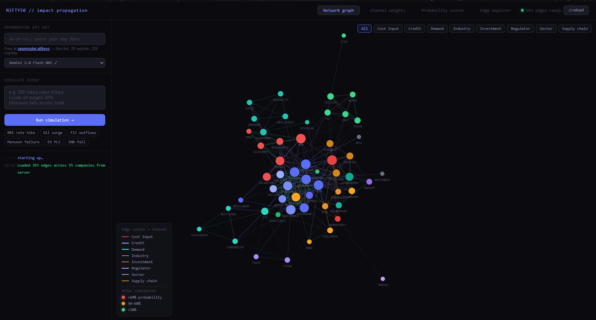

# market-impact-graph

A graph-based system that models how financial events propagate across Nifty50 companies using market data-driven relationships and BFS-based impact diffusion.

Live : [https://mayank-golchha.github.io/market-impact-graph](https://mayank-golchha.github.io/market-impact-graph)

---



---

## What it does

This tool lets you simulate the ripple effect of a financial event — such as an RBI rate hike or a crude oil surge — across the Nifty50 universe. It models relationships between companies across eight channels: cost input, credit, demand, industry linkages, investment flows, regulatory impact, sector dynamics, and supply chain dependencies.

When you describe an event, an LLM (via OpenRouter) analyzes the edge graph and returns impact probabilities, channel weight vectors, and propagation paths for each affected company. The results are visualized as an interactive force-directed network graph.

---

## Requirements

To run simulations, you need a free OpenRouter API key.

Get one at [https://openrouter.ai/keys](https://openrouter.ai/keys)

OpenRouter's free tier supports up to 20 requests per minute and 200 requests per day, which is sufficient for personal use. Once you have the key, paste it into the API key field in the left panel of the app.

No account or payment is required for the free tier.

---

## Features

- Interactive force-directed graph of Nifty50 company relationships
- Eight relationship channels with color-coded edges
- LLM-powered event simulation using models including Gemini 2.0 Flash, Llama 4, DeepSeek R1, and others
- BFS-based impact diffusion with configurable depth and decay
- Probability scores and channel weight breakdown per company
- Edge explorer with filtering, search, and CSV export
- Node detail panel showing direct connections and propagation paths

---

## How to use

1. Open the website link above
2. Paste your OpenRouter API key into the field on the left panel
3. Select a model from the dropdown (Gemini 2.0 Flash is recommended for speed)
4. Type a financial event in the simulation box, or click one of the preset tags
5. Click "Run simulation"
6. View results in the Network graph, Channel weights, and Probability scores tabs

---

## Running locally

The frontend is a single static HTML file. The backend server reads CSV files containing the edge data and serves them via a local API.

```bash
# Clone the repo
git clone https://github.com/Mayank-Golchha/market-impact-graph.git
cd market-impact-graph

# Install dependencies
npm install

# Point CSV_DIR in server.js to your local edges folder, then start the server
node server.js
```

Then open `http://localhost:3000` in your browser.

---

## Tech stack

- D3.js for graph rendering and force simulation
- OpenRouter API for LLM inference
- Node.js HTTP server for CSV edge data
- Vanilla HTML, CSS, JavaScript for the frontend
- GitHub Pages for static hosting

---

## License

MIT
